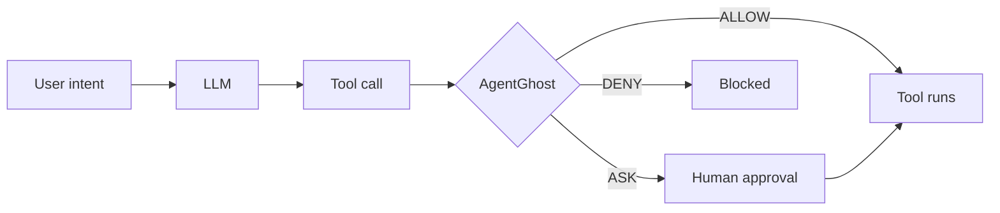
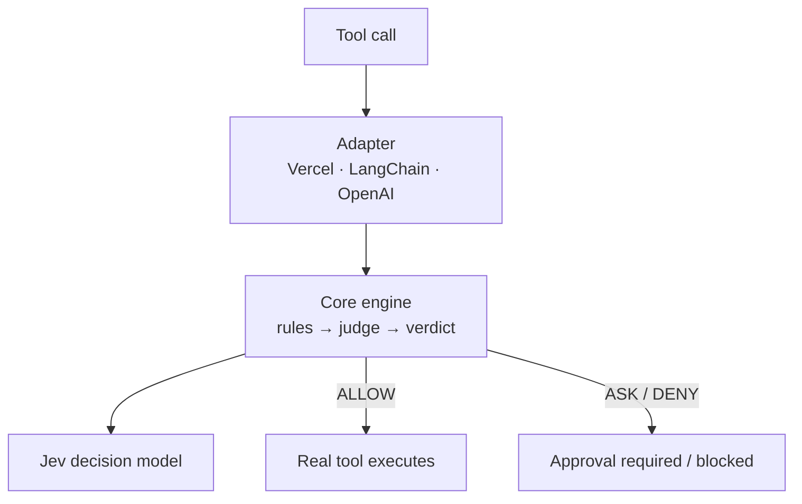

<p align="center">
  
</p>

<p align="center">
  <a href="https://github.com/reddpy/AgentGhost/actions/workflows/ci.yml"></a>
  <a href="https://www.npmjs.com/package/@agentghost/sdk"></a>
  <a href="./LICENSE"></a>
  
</p>

# AgentGhost

Intent-aware authorization for AI agent tools. AgentGhost wraps the execution of
your tools, so every consequential action passes an `ALLOW` / `ASK` / `DENY`
check before it runs. The decision is made by [Jev](https://typesafe.ai), a fast
System One model, with deterministic rules as a first pass.

The model never decides whether AgentGhost runs. AgentGhost *is* the tool's execution
function.

```
user intent -> LLM -> tool call -> [ AGENTGHOST ] -> real tool
```



## Install

```bash
npm install @agentghost/vercel ai          # Vercel AI SDK
npm install @agentghost/langchain          # LangChain.js
npm install @agentghost/openai             # OpenAI / Anthropic tool calling
```

Set a judge key — AgentGhost reads it automatically:

```bash
export AI_GATEWAY_API_KEY=...   # Jev via Vercel AI Gateway
# or
export TYPESAFE_API_KEY=...     # Jev direct (no `ai` package needed)
```

## Requirements

- **Node.js 20+**. Ships ESM and CommonJS with TypeScript types.
- **A judge** — one of: `AI_GATEWAY_API_KEY` (Jev via Vercel AI Gateway, needs
  the optional `ai` peer at AI SDK 7.0.105+), `TYPESAFE_API_KEY` (Jev direct,
  uses `fetch`), or your own `Judge`.
- `@agentghost/sdk` has **no runtime dependencies**. `ai` and the framework SDKs
  are optional peers you already use.

## Quickstart

AgentGhost is framework-agnostic: the same `guard()` wraps tools from any agent
framework. Here it is with the Vercel AI SDK:

```ts
import { generateText } from "ai";            // Vercel AI SDK
import { guard } from "@agentghost/vercel";   // AgentGhost

const safeTools = guard(tools, { intent: () => currentTask });

const result = await generateText({ model, tools: safeTools, prompt });
```

`guard()` returns the same tools with each execution wrapped, so they drop into
your agent unchanged. `intent` is a function because the user's task changes
during a conversation. (`generateText`, `model`, `prompt`, and `currentTask` are
yours — AgentGhost only supplies `guard` and `safeTools`.)

The same two lines work for other frameworks:

```ts
import { createAgent } from "langchain";       // LangChain.js
import { guard } from "@agentghost/langchain";

const safeTools = guard(tools, { intent: () => currentTask });
const agent = createAgent({ model, tools: safeTools });
```

```ts
import { guardOpenAI } from "@agentghost/openai";

// executeTool is your own (name, args) => result function.
const run = guardOpenAI(executeTool, { tools, intent: () => currentTask });
// call run(name, args) instead of switching on the tool name
```

Need another framework? An adapter is about ten lines with `defineGuard`, and an
MCP proxy is on the roadmap.

## How it works

One authorization engine, one thin adapter per framework. A tool call is
normalized by the adapter, evaluated against the current intent, and only the
real tool runs on `ALLOW`.



## Decisions

Every protected tool call gets one of three verdicts, each with a reason and a
confidence:

| Verdict | Meaning | Default behavior |
| --- | --- | --- |
| `ALLOW` | Serves the intent and is safe | Tool runs |
| `ASK` | Consequential or uncertain | Throws `AgentGhostApprovalRequiredError` |
| `DENY` | Out of scope or harmful | Throws `AgentGhostDeniedError` |

`ASK` and `DENY` throw by default so an approval can never be silently skipped.
Wire approval in one line with `approveWith` or `terminalApproval`:

```ts
import { guard, approveWith, terminalApproval } from "@agentghost/vercel";

// Use your own UI / HITL system:
guard(tools, { intent: () => currentTask, onAsk: approveWith((req) => ui.confirm(req)) });

// Or a ready-made terminal prompt (denies when there is no TTY):
guard(tools, { intent: () => currentTask, onAsk: terminalApproval() });
```

A blocked call surfaces to the agent as a tool error, so the model can tell the
user what it could not do.

## Policies without the model

Keep the fast path fast and hard-code the obvious cases. `allow`, `ask`, and
`deny` are shorthands evaluated before the judge (and `allow` skips it entirely):

```ts
guard(tools, {
  intent: () => currentTask,
  allow: ["read_file", "list_files", "get_order"], // read-only: no model call
  ask: ["send_email"],
  deny: ["drop_database"],
});
```

For richer rules, use the rule factories:

```ts
import { guard, denyTools, allowOnly, matchArg } from "@agentghost/sdk";

guard(tools, {
  intent: () => currentTask,
  rules: [
    matchArg({ field: "query", pattern: /\bDROP\b/i, decision: "DENY", reason: "no DDL" }),
    allowOnly(["read_file", "search"]),
  ],
});
```

## Configuration

```ts
guard(tools, {
  intent: () => currentTask, // string | object | () => intent
  judge: undefined,          // custom Judge, or null for rules-only
  allow: [], ask: [], deny: [],
  rules: [],
  protect: ["send_email"],   // only protect these (default: all tools)
  failMode: "closed",        // "closed" denies when the judge errors (default)
  evaluate: "always",        // "once" caches identical decisions
  onAsk: approveWith(...),
  onDeny: (req, verdict) => audit.log(verdict), // notified on DENY; action stays blocked
  onDecision: (req, verdict) => audit.log(verdict), // every verdict
  context: { tenantId },     // attached to every authorization
});
```

Missing configuration fails fast: `guard()` throws `AgentGhostConfigError` if there is
no judge, no key, and no `judge: null`.

Use Jev directly (TypeSafe API) or the AI SDK's evaluation model if you prefer:

```ts
import { createJevJudge, createJevJudgeFromEvaluate, createGatewayJudge } from "@agentghost/sdk";
```

## Switching the judge

AgentGhost talks to Jev behind a small `Judge` interface, so changing providers
is a config swap, not a rewrite. Jev is reachable through a growing set of
gateways: the Vercel AI Gateway and the TypeSafe direct API work today, and more
gateways and first-class access paths are planned. Anything that serves Jev — or
a different decision model entirely — plugs in the same way.

- **Vercel AI Gateway (default):** set `AI_GATEWAY_API_KEY`.
- **Direct Jev API key:** set `TYPESAFE_API_KEY`. No `ai` package needed — the
  direct client uses `fetch`. If both keys are present, force one with
  `AGENTGHOST_JUDGE=gateway` or `AGENTGHOST_JUDGE=typesafe`.
- **Another gateway that speaks the System One protocol:** point the direct
  client at it.
  ```ts
  import { createJevJudge } from "@agentghost/sdk";
  guard(tools, { intent: () => currentTask, judge: createJevJudge({ baseUrl, apiKey }) });
  ```
- **Any AI-SDK-compatible gateway or model:**
  ```ts
  import { createJevJudgeFromEvaluate } from "@agentghost/sdk";
  guard(tools, {
    intent: () => currentTask,
    judge: createJevJudgeFromEvaluate({ evaluate, model }),
  });
  ```
- **A different decision model entirely:**
  ```ts
  import { defineJudge } from "@agentghost/sdk";
  const myJudge = defineJudge("my-model", async (request) => ({
    decision: "ALLOW", // or "ASK" / "DENY"
    reason: "...",
  }));
  ```

Adapters, rules, verdicts, and approval stay exactly the same.

## Packages

| Package | What it does |
| --- | --- |
| `@agentghost/sdk` | Core engine, rules, Jev judge, `approveWith` / `terminalApproval` |
| `@agentghost/vercel` | Wraps Vercel AI SDK tool sets |
| `@agentghost/langchain` | Wraps LangChain.js tools (keeps their prototype) |
| `@agentghost/openai` | Wraps OpenAI / Anthropic dispatchers |

All adapters are backed by the same core authorization engine and re-export the
same helpers, so you usually only import your framework's package. Every package
ships ESM and CommonJS with TypeScript types (`import` or `require`).

## Examples

```bash
# Simple: call the tools directly and print each verdict.
bun run example:basic           # core SDK, no framework
bun run example:vercel          # Vercel AI SDK
bun run example:langchain       # LangChain.js
bun run example:openai          # OpenAI / Anthropic tool calling

# Real: an email-assistant chatbot running the full agent loop.
bun run example:real:vercel
bun run example:real:langchain
bun run example:real:openai
```

The real examples prompt `y/N` for ASK decisions in a terminal. To auto-approve
unattended, set `AGENTGHOST_AUTO_APPROVE=1`.

## Limitations

AgentGhost protects tools whose execution you control. Provider-hosted tools that run
entirely inside OpenAI / Anthropic are out of reach; MCP is planned as a proxy.
